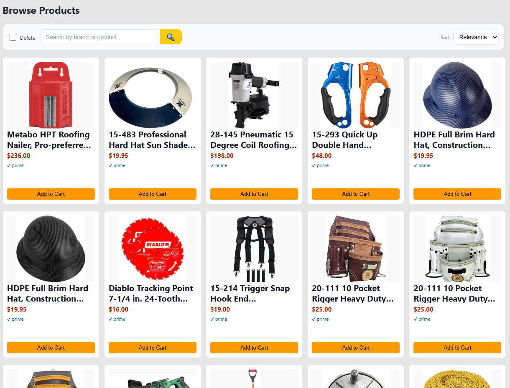
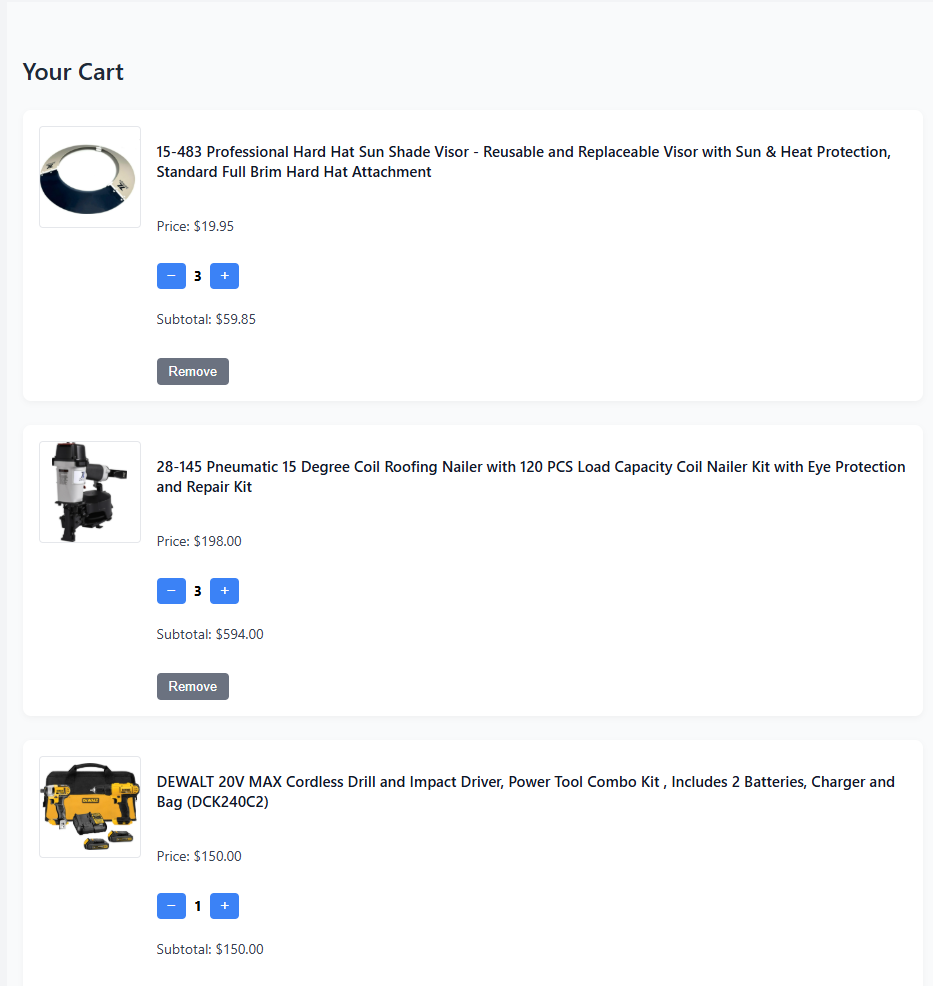
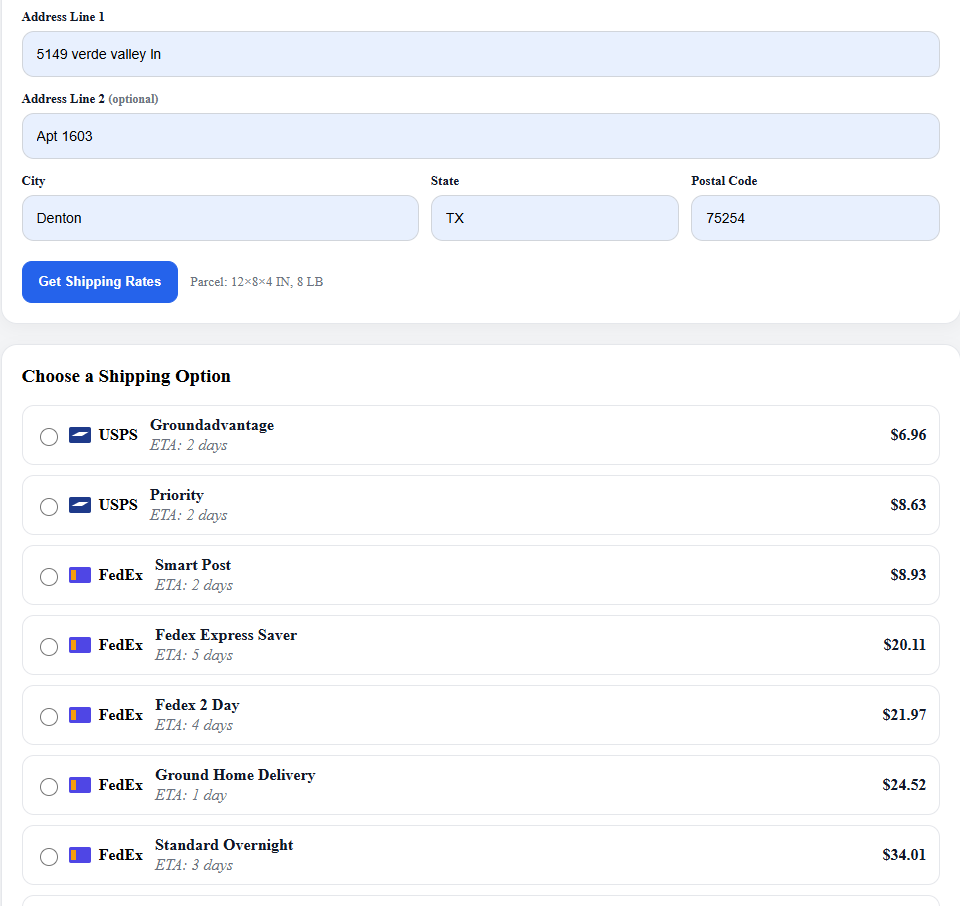
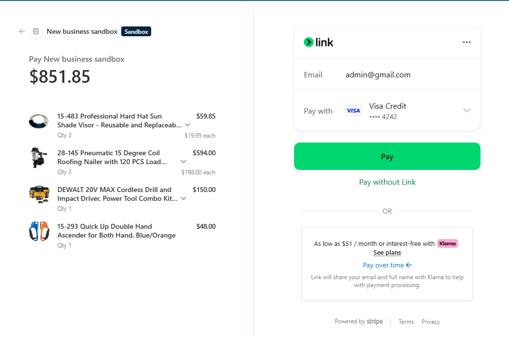
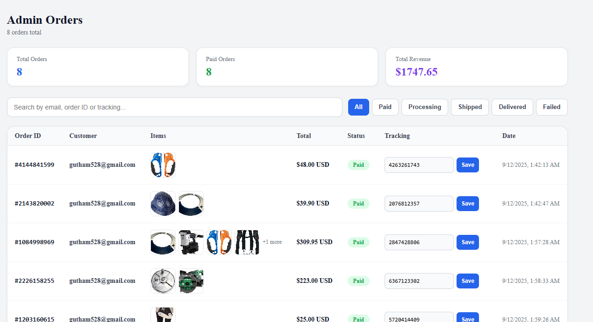

# 🏗️ Hardware City — Full-Stack E-Commerce Platform

A production-ready e-commerce web application for a hardware store, built with **React**, **Node.js/Express**, **Firebase**, **Stripe**, and **EasyPost**.

🌐 **Live Demo:** [ecommerce-management-system-sandy.vercel.app](https://ecommerce-management-system-sandy.vercel.app)

---

## 📸 Screenshots

### 🛍️ Browse Products


### 📦 Product Detail


### 🛒 Shopping Cart


### 🚚 Checkout & Shipping Rates


### 💳 Stripe Payment


### 🛠️ Admin Orders Dashboard


---

## ✨ Features

### 🛍️ Customer
- Browse & search products with fuzzy search and autocomplete
- Product detail pages with image gallery
- Shopping cart with real-time Firestore sync
- Stripe-powered checkout with secure payment
- Shipping rate calculator (USPS, FedEx via EasyPost)
- Order history with live status tracking

### 🔐 Authentication
- Firebase Auth — email/password login & signup
- Role-based access control (admin vs customer)
- Protected admin routes

### 🛠️ Admin
- Add / edit / delete products with image upload
- Admin Orders dashboard with:
  - Revenue summary cards
  - Search & filter by status (Paid, Processing, Shipped, Delivered)
  - Generate & save 10-digit tracking numbers
  - Real-time order updates via Stripe webhooks

---

## 🧱 Tech Stack

| Layer | Technology |
|---|---|
| Frontend | React 18, React Router v7, Firebase SDK |
| Backend | Node.js, Express |
| Auth | Firebase Authentication + Firestore |
| Payments | Stripe (Checkout + Webhooks) |
| Shipping | EasyPost API (USPS, FedEx, UPS) |
| Deployment | Vercel (frontend) + Railway (backend) |

---

## 🚀 Getting Started

### Prerequisites
- Node.js 18+
- Firebase project
- Stripe account
- EasyPost account

### Installation

```bash
# Clone the repo
git clone https://github.com/gouthamkolusu/ecommerce-management-system.git
cd ecommerce-management-system

# Install server dependencies
cd server && npm install

# Install client dependencies
cd ../client && npm install
```

### Environment Variables

Create `server/.env`:
```
STRIPE_SECRET_KEY=sk_test_...
STRIPE_WEBHOOK_SECRET=whsec_...
EASYPOST_API_KEY=EZTK...
FIREBASE_PROJECT_ID=your-project-id
FIREBASE_SERVICE_ACCOUNT={"type":"service_account",...}
CORS_ORIGIN=http://localhost:3000
PORT=4000
```

Create `client/.env`:
```
REACT_APP_SERVER_URL=http://localhost:4000
```

### Run Locally

```bash
# Terminal 1 — Start backend
cd server && npm run dev

# Terminal 2 — Start frontend
cd client && npm start
```

---

## 📁 Project Structure

```
├── client/                 # React frontend
│   └── src/
│       ├── components/     # Reusable UI components
│       ├── contexts/       # Auth & Cart context
│       ├── pages/
│       │   ├── public/     # Customer pages
│       │   └── admin/      # Admin pages
│       └── lib/            # API client, Firebase config
│
└── server/                 # Express backend
    └── src/
        ├── routes/         # API endpoints
        ├── data/           # JSON data store
        ├── core/           # Firebase Admin
        └── shipping/       # EasyPost integration
```

---

## 📄 License

MIT © Goutham Kolusu
